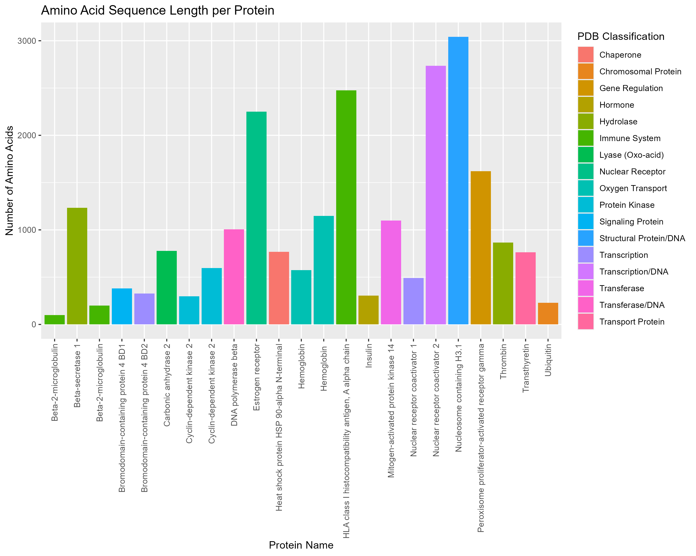
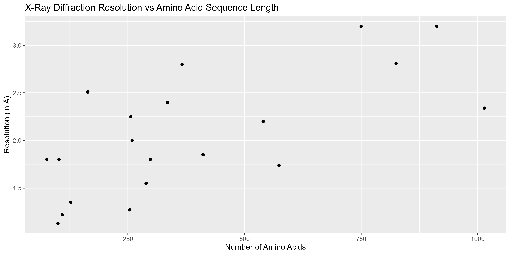
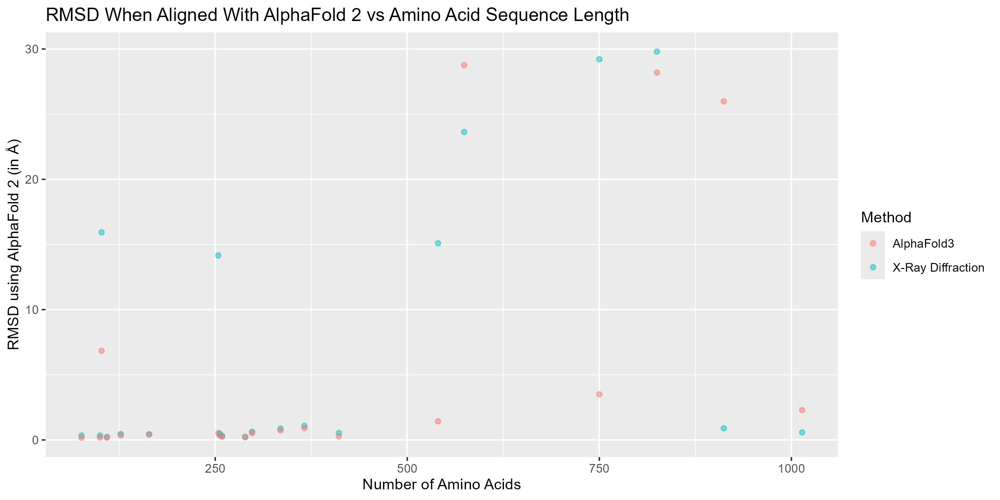
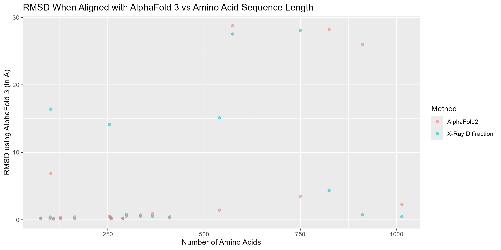
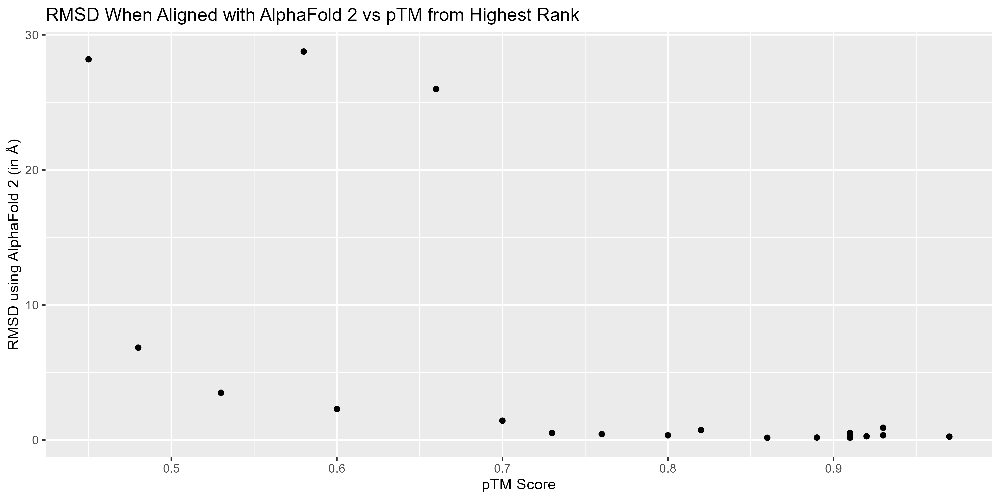
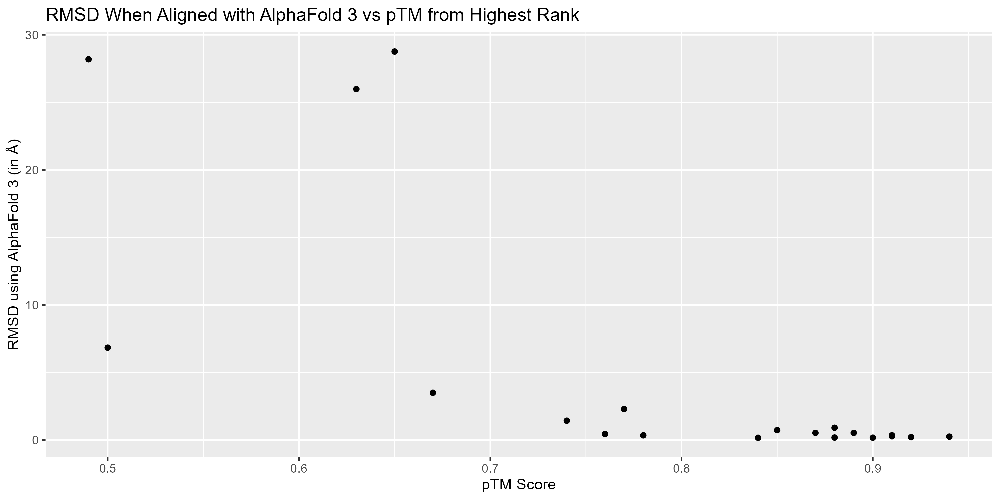
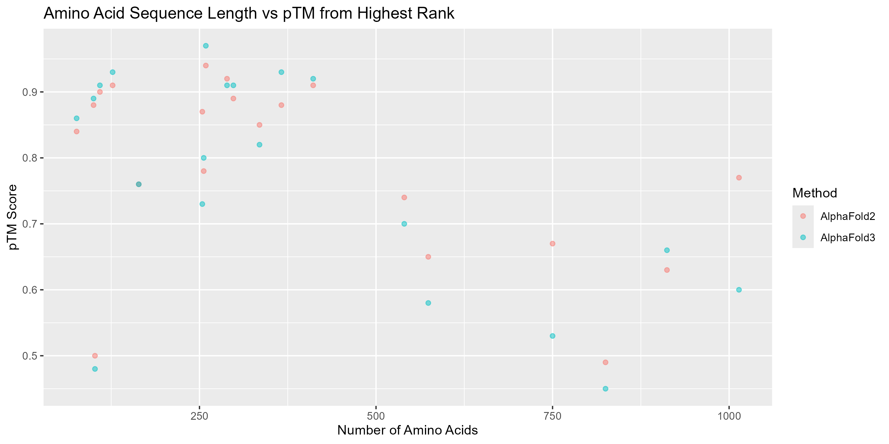
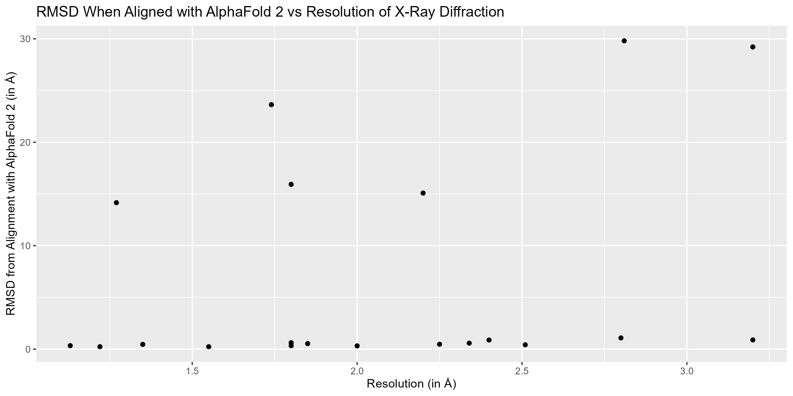
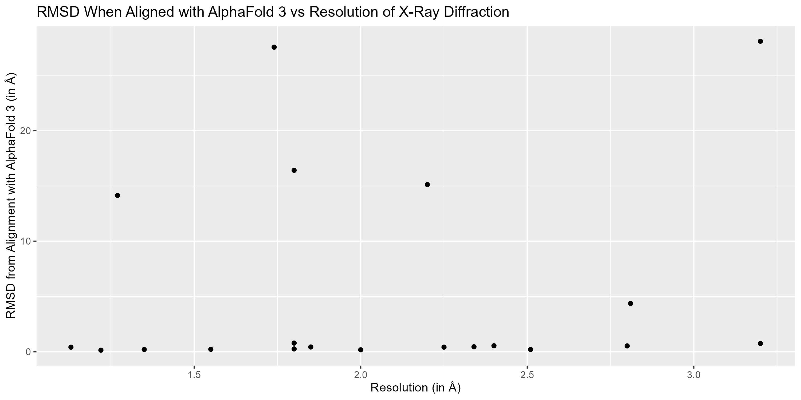

```{r setup, include=FALSE}
knitr::opts_chunk$set(echo = TRUE)
```

# Introduction
Two key aspects of proteins determine their function: the amino acid/DNA sequence and structure. While protein/DNA sequencing methods have developed significantly in accuracy, efficiency, and cost in recent decades, this is not the case for protein structure. Until fairly recently (within the past few years), the only methods to nearly absolutely determine the structure of a protein were experimental, expensive and tedious, like x-ray diffraction. In x-ray diffraction, a protein is crystallized and beamed with x-rays, then the resulting diffraction patterns are used by a molecular visualization system to create an image of a cohesive structure. 

With the rise of artificial intelligence, a new method has emerged, a system called AlphaFold. Now, anyone with the amino acid sequence of a protein can simply put it into AlphaFold and generate five predicted protein structures, ranked in order likelihood. However, the structures that this system generates do not always match the experimentally-determined structures. In drug-target research, using the wrong structure would be an enormous waste of time and money, since drugs are specifically designed to fit on/within the protein itself. Additionally, another version of AlphaFold was released earlier this year, but the previous version is still available. Therefore, the goal of my project was to compare/contrast 20 of the most studied human proteins through the following characteristics: protein classification, structure identification/prediction method (x-ray diffraction, AlphaFold 2, AlphaFold 3), number of amino acids in sequence, pTM, and RMSD.

## Key Terms 
pTM: predicted template-modeling score; predicts the similarity between a protein model structure and the true protein structure; the score is a number between 0 and 1 with higher values indicating greater quality

RMSD (in Å): root-mean square deviation (in angstroms); calculates the differences between predicted and observed values such as length in angstroms, and can be used to determine the similarity between two protein structures; the lower the number, the greater the similarity

Resolution (in Å): measure of the smallest distance (in angstroms) between two objects that can be distinguished; the lower the number, the greater the detail; a distance of 1 angstrom means that individual atoms are distinguishable

PyMOL: molecular visualization system that can convert raw x-ray diffraction data into a cohesive protein structure

PDB: Protein Data Bank, a database for protein and DNA structural data; also refers to a file format in which structural data can be kept

AlphaFold2 and 3: artificial intelligence program that can predict protein structures from amino acid sequences

p-value: probability of obtaining the results through random chance and is used as a measure of data significance; the threshold/standard p-value to indicate extreme significance is <0.05

# Data Setup
To begin, I found a scientific paper that listed the most commonly studied proteins and set up a spreadsheet to record my findings. For the first 20 proteins I could find thorough PDB entries for, I took note of the name, PDB classification, PDB ID, and x-ray diffraction resolution. After downloading the PDB file for each protein, I then utilized the bio3d and tidyverse packages to 1) extract the amino acid sequences, and 2) convert them from a three-letter format to a one-letter format (which is what AlphaFold requires).

## Load Packages
```{r message=FALSE, warning=FALSE}
library(bio3d)
library(tidyverse)
```

## Amino Acid Sequence Extraction & 3-to-1 Conversion
```{r message=FALSE, warning=FALSE, results='hide'}
pdb_files <- list.files(path = "PDBs/", pattern = "\\.pdb$", full.names = TRUE)
all_sequences <- pdb_files %>%
  set_names(str_remove(basename(.), "\\.pdb$")) %>%
  map(~ read.pdb(.)$seqres %>% 
        aa321() %>% 
        paste(collapse = ""))
print(all_sequences)
```

Once I copied each sequence to my spreadsheet, I ran the sequences through AlphaFold 2 and 3. (This was probably the most time-intensive portions of my project, with AlphaFold 2 taking at least an hour one the same sequences that would only take AlphaFold 3 ten minutes.) Both AlphaFold 2 and 3 give multiple protein structures and rank them from most-to-least likely as part of the output. Once I had all of the files, I organized the models with the highest ranking into their own folder and recorded the pTM values in my spreadsheet. I also utilized AlphaFold 3 to make note of the number of amino acids in each sequence. (Some of the PDB files were a little messy so any "character count" code I tried did not work well.)

Finally, it was time to align the structures using PyMOL. What is really neat about PyMOL is that is has a click-based interface and a command-line that runs Python, and I took the opportunity to use both. I used the command-line for uploading/naming each of the structures, as well as removing nucleic acid residues that sometimes came up in the x-ray diffraction files. 

```{r image-gallery, echo=FALSE, fig.show="hold", out.width="75%", fig.align="center", fig.cap="Example PyMOL commands and outputs (PDB 4HHB)."}
knitr::include_graphics(c("PyMOLCodes/LoadCleanXRay.png", "PyMOLCodes/CleanLoadAlignx2.png", "PyMOLCodes/LoadAlign2-3.png", "PyMOLCodes/Align2-3x3.png"))
```

I used the click-based controls to remove water molecules, ligands and other atoms, then to perform the actual structural alignments using the "align to molecule" function. Interestingly enough, the command-line version of the alignment function would give out slightly different RMSD values than the click-based version. I was originally instructed by a professor who was familiar with PyMOL and protein structural alignments to use the "alignment to molecule" function, so that's why I went that route. I recorded the RMSD values in my spreadsheet for the following comparisons: 

X-Ray Diffraction to AlphaFold 2

X-Ray Diffraction to AlphaFold 3

AlphaFold 2 to AlphaFold 3

With the all of the alignments completed, I converted my spreadsheet to a .csv file and read my data into RStudio. For some reason, during the conversion my "Methods" column ended up with a lot of whitespace, which I used an additional line of code to get rid of. 

```{r}
protein_df <- read.csv('Protein_Structures_Comparison.csv') %>% 
  mutate(Method = trimws(Method))
```

# Protein Alignment Image Gallery
For the following images, each color refers to a different method. Red is for x-ray diffraction, blue is for AlphaFold 2, and tan is for AlphaFold 3. The order of the images is also significant. The first image shows x-ray diffraction and AlphaFold 2, the second is x-ray diffraction and AlphaFold 3, and the third is AlphaFold 2 and 3. 

```{r image-gallery 1CA2, echo=FALSE, fig.show="hold", out.width="33%", fig.align="center", fig.cap="Alignments for Carbonic anhydrase 2 (PDB 1CA2)."}
knitr::include_graphics(c("Alignments/1CA2_x-2.png", "Alignments/1CA2_x-3.png", "Alignments/1CA2_2-3.png"))
```

```{r image-gallery 2YXF, echo=FALSE, fig.show="hold", out.width="33%", fig.align="center", fig.cap="Alignments for Beta‐2‐microglobulin (PDB 2YXF)."}
knitr::include_graphics(c("Alignments/2YXF_x-2.png", "Alignments/2YXF_x-3.png", "Alignments/2YXF_2-3.png"))
```

```{r image-gallery 2ZHV, echo=FALSE, fig.show="hold", out.width="33%", fig.align="center", fig.cap="Alignments for Beta-secretase 1 (PDB 2ZHV)."}
knitr::include_graphics(c("Alignments/2ZHV_x-2.png", "Alignments/2ZHV_x-3.png", "Alignments/2ZHV_2-3.png"))
```

```{r image-gallery 1HCK, echo=FALSE, fig.show="hold", out.width="33%", fig.align="center", fig.cap="Alignments for Cyclin‐dependent kinase 2 (PDB 1HCK)."}
knitr::include_graphics(c("Alignments/1HCK_x-2.png", "Alignments/1HCK_x-3.png", "Alignments/1HCK_2-3.png"))
```

```{r image-gallery 3U69, echo=FALSE, fig.show="hold", out.width="33%", fig.align="center", fig.cap="Alignments for Thrombin (PDB 3U69)."}
knitr::include_graphics(c("Alignments/3U69_x-2.png", "Alignments/3U69_x-3.png", "Alignments/3U69_2-3.png"))
```

```{r image-gallery 2OSS, echo=FALSE, fig.show="hold", out.width="33%", fig.align="center", fig.cap="Alignments for Bromodomain‐containing protein 4 BD1 (PDB 2OSS)."}
knitr::include_graphics(c("Alignments/2OSS_x-2.png", "Alignments/2OSS_x-3.png", "Alignments/2OSS_2-3.png"))
```

```{r image-gallery 7USK, echo=FALSE, fig.show="hold", out.width="33%", fig.align="center", fig.cap="Alignments for Bromodomain‐containing protein 4 BD2 (PDB 7USK)."}
knitr::include_graphics(c("Alignments/7USK_x-2.png", "Alignments/7USK_x-3.png", "Alignments/7USK_2-3.png"))
```

```{r image-gallery 1BPX, echo=FALSE, fig.show="hold", out.width="33%", fig.align="center", fig.cap="Alignments for DNA polymerase beta (PDB 1BPX)."}
knitr::include_graphics(c("Alignments/1BPX_x-2.png", "Alignments/1BPX_x-3.png", "Alignments/1BPX_2-3.png"))
```

```{r image-gallery 6EQB, echo=FALSE, fig.show="hold", out.width="33%", fig.align="center", fig.cap="Alignments for HLA class I histocompatibility antigen, A alpha chain (PDB 6EQB)."}
knitr::include_graphics(c("Alignments/6EQB_x-2.png", "Alignments/6EQB_x-3.png", "Alignments/6EQB_2-3.png"))
```

```{r image-gallery 4MRB, echo=FALSE, fig.show="hold", out.width="33%", fig.align="center", fig.cap="Alignments for Transthyretin (PDB 4MRB)."}
knitr::include_graphics(c("Alignments/4MRB_x-2.png", "Alignments/4MRB_x-3.png", "Alignments/4MRB_2-3.png"))
```

```{r image-gallery 6GQ6, echo=FALSE, fig.show="hold", out.width="33%", fig.align="center", fig.cap="Alignments for Heat shock protein HSP 90‐alpha N-terminal (PDB 6GQ6)."}
knitr::include_graphics(c("Alignments/6GQ6_x-2.png", "Alignments/6GQ6_x-3.png", "Alignments/6GQ6_2-3.png"))
```

```{r image-gallery 3DZU, echo=FALSE, fig.show="hold", out.width="33%", fig.align="center", fig.cap="Alignments for Nuclear receptor coactivator 2 (PDB 3DZU)."}
knitr::include_graphics(c("Alignments/3DZU_x-2.png", "Alignments/3DZU_x-3.png", "Alignments/3DZU_2-3.png"))
```

```{r image-gallery 1QKU, echo=FALSE, fig.show="hold", out.width="33%", fig.align="center", fig.cap="Alignments for Estrogen receptor (PDB 1QKU)."}
knitr::include_graphics(c("Alignments/1QKU_x-2.png", "Alignments/1QKU_x-3.png", "Alignments/1QKU_2-3.png"))
```

```{r image-gallery 4F1A, echo=FALSE, fig.show="hold", out.width="33%", fig.align="center", fig.cap="Alignments for Insulin (PDB 4F1A)."}
knitr::include_graphics(c("Alignments/4F1A_x-2.png", "Alignments/4F1A_x-3.png", "Alignments/4F1A_2-3.png"))
```

```{r image-gallery 4HHB, echo=FALSE, fig.show="hold", out.width="33%", fig.align="center", fig.cap="Alignments for Hemoglobin (PDB 4HHB)."}
knitr::include_graphics(c("Alignments/4HHB_x-2.png", "Alignments/4HHB_x-3.png", "Alignments/4HHB_2-3.png"))
```

```{r image-gallery 5B1M, echo=FALSE, fig.show="hold", out.width="33%", fig.align="center", fig.cap="Alignments for Nucleosome containing H3.1 (PDB 5B1M)."}
knitr::include_graphics(c("Alignments/5B1M_x-2.png", "Alignments/5B1M_x-3.png", "Alignments/5B1M_2-3.png"))
```

```{r image-gallery 5ETI, echo=FALSE, fig.show="hold", out.width="33%", fig.align="center", fig.cap="Alignments for Mitogen‐activated protein kinase 14 (PDB 5ETI)."}
knitr::include_graphics(c("Alignments/5ETI_x-2.png", "Alignments/5ETI_x-3.png", "Alignments/5ETI_2-3.png"))
```

```{r image-gallery 1UBQ, echo=FALSE, fig.show="hold", out.width="33%", fig.align="center", fig.cap="Alignments for Ubiquitin (PDB 1UBQ)."}
knitr::include_graphics(c("Alignments/1UBQ_x-2.png", "Alignments/1UBQ_x-3.png", "Alignments/1UBQ_2-3.png"))
```

```{r image-gallery 5NWX, echo=FALSE, fig.show="hold", out.width="33%", fig.align="center", fig.cap="Alignments for Nuclear receptor coactivator 1 (PDB 5NWX)."}
knitr::include_graphics(c("Alignments/5NWX_x-2.png", "Alignments/5NWX_x-3.png", "Alignments/5NWX_2-3.png"))
```

```{r image-gallery 1PRG, echo=FALSE, fig.show="hold", out.width="33%", fig.align="center", fig.cap="Alignments for Peroxisome proliferator‐activated receptor gamma (PDB 1PRG)."}
knitr::include_graphics(c("Alignments/1PRG_x-2.png", "Alignments/1PRG_x-3.png", "Alignments/1PRG_2-3.png"))
```

# Plots

After all of the alignments were completed, I made several plots to explore the relationships between the variables I selected. 

## Amino Acid Sequence Length per Protein
```{r echo=TRUE, message=FALSE, warning=FALSE}
plot_type_aa <- protein_df %>% 
  ggplot(aes(x = Protein_Name,
             y = Number_of_AA, 
             fill = PDB_Class)) +
  geom_bar(stat = 'identity') +
  labs(x = "Protein Name",
       y = "Number of Amino Acids",
       title = "Amino Acid Sequence Length per Protein",
       fill = "PDB Classification") +
  theme(axis.text.x = element_text(angle = 90, vjust = 0.5, hjust = 1))
ggsave('Plots/type_aa.png', plot = plot_type_aa,  
       dpi = 300, height = 8, width = 10)
```

```{r, echo=FALSE}

```  

## X-Ray Diffraction Resolution vs Amino Acid Sequence Length
```{r echo=TRUE, message=FALSE, warning=FALSE}
plot_aa_xray <- protein_df %>% 
  filter(!is.na(Resolution)) %>% 
  ggplot(aes(x = Number_of_AA,
             y = Resolution)) +
  geom_point() +
  labs(x = "Number of Amino Acids",
       y = "Resolution (in Å)",
       title = "X-Ray Diffraction Resolution vs Amino Acid Sequence Length") 
ggsave('Plots/aa_xray.png', plot = plot_aa_xray,  
       dpi = 300, height = 5, width = 10)
```

```{r, echo=FALSE}

``` 
 
## RMSD When Aligned With AlphaFold 2 vs Amino Acid Sequence Length
```{r echo=TRUE, message=FALSE, warning=FALSE}
plot_aa_rmsd2 <- protein_df %>% 
  filter(!is.na(RMSD_2)) %>% 
  ggplot(aes(x = Number_of_AA,
             y = RMSD_2, 
             color = Method)) +
  geom_point(alpha = 0.5) +
  labs(x = "Number of Amino Acids",
       y = "RMSD using AlphaFold 2 (in Å)",
       title = "RMSD When Aligned With AlphaFold 2 vs Amino Acid Sequence Length") 
ggsave('Plots/aa_rmsd2.png', plot = plot_aa_rmsd2,  
       dpi = 300, height = 5, width = 10)
```

```{r, echo=FALSE}

```  

## RMSD When Aligned with AlphaFold 3 vs Amino Acid Sequence Length
```{r echo=TRUE, message=FALSE, warning=FALSE}
plot_aa_rmsd3 <- protein_df %>% 
  filter(!is.na(RMSD_3)) %>% 
  ggplot(aes(x = Number_of_AA,
             y = RMSD_3,
             color = Method)) +
  geom_point(alpha = 0.5) +
  labs(x = "Number of Amino Acids",
       y = "RMSD using AlphaFold 3 (in Å)",
       title = "RMSD When Aligned with AlphaFold 3 vs Amino Acid Sequence Length") 
ggsave('Plots/aa_rmsd3.png', plot = plot_aa_rmsd3,  
       dpi = 300, height = 5, width = 10)
```

```{r, echo=FALSE}

```  

## RMSD When Aligned with AlphaFold 2 vs pTM from Highest Rank
```{r echo=TRUE, message=FALSE, warning=FALSE}
plot_ptm_rmsd2 <- protein_df %>% 
  filter(!is.na(highest_pTM) & !is.na(RMSD_2)) %>% 
  ggplot(aes(x = highest_pTM,
             y = RMSD_2)) +
  geom_point() +
  labs(x = "pTM Score",
       y = "RMSD using AlphaFold 2 (in Å)",
       title = "RMSD When Aligned with AlphaFold 2 vs pTM from Highest Rank")
ggsave('Plots/ptm_rmsd2.png', plot = plot_ptm_rmsd2,  
       dpi = 300, height = 5, width = 10)
```

```{r, echo=FALSE}

```  

## RMSD When Aligned with AlphaFold 3 vs pTM from Highest Rank
```{r echo=TRUE, message=FALSE, warning=FALSE}
plot_ptm_rmsd3 <- protein_df %>% 
  filter(!is.na(highest_pTM) & !is.na(RMSD_3)) %>% 
  ggplot(aes(x = highest_pTM,
             y = RMSD_3)) +
  geom_point() +
  labs(x = "pTM Score",
       y = "RMSD using AlphaFold 3 (in Å)",
       title = "RMSD When Aligned with AlphaFold 3 vs pTM from Highest Rank")
ggsave('Plots/ptm_rmsd3.png', plot = plot_ptm_rmsd3,  
       dpi = 300, height = 5, width = 10)
```

```{r, echo=FALSE}

```  

## Amino Acid Sequence Length vs pTM from Highest Rank
```{r echo=TRUE, message=FALSE, warning=FALSE}
plot_aa_ptm <- protein_df %>% 
  filter(!is.na(highest_pTM)) %>% 
  ggplot(aes(x = Number_of_AA,
             y = highest_pTM, 
             color = Method)) +
  geom_point(alpha = 0.5) +
  labs(x = "Number of Amino Acids",
       y = "pTM Score",
       title = "Amino Acid Sequence Length vs pTM from Highest Rank")
ggsave('Plots/aa_ptm.png', plot = plot_aa_ptm,  
       dpi = 300, height = 5, width = 10)
```

```{r, echo=FALSE}

```  

## RMSD When Aligned with AlphaFold 2 vs Resolution of X-Ray Diffraction
```{r echo=TRUE, message=FALSE, warning=FALSE}
plot_xray_rmsd2 <- protein_df %>% 
  filter(!is.na(Resolution) & !is.na(RMSD_2)) %>% 
  ggplot(aes(x = Resolution,
             y = RMSD_2)) +
  geom_point() +
  labs(x = "Resolution (in Å)",
       y = "RMSD from Alignment with AlphaFold 2 (in Å)",
       title = "RMSD When Aligned with AlphaFold 2 vs Resolution of X-Ray Diffraction")
ggsave('Plots/xray_rmsd2.png', plot = plot_xray_rmsd2,  
       dpi = 300, height = 5, width = 10)
```

```{r, echo=FALSE}

```  

## RMSD When Aligned with AlphaFold 3 vs Resolution of X-Ray Diffraction
```{r echo=TRUE, message=FALSE, warning=FALSE}
plot_xray_rmsd3 <- protein_df %>% 
  filter(!is.na(Resolution) & !is.na(RMSD_3)) %>% 
  ggplot(aes(x = Resolution,
             y = RMSD_3)) +
  geom_point() +
  labs(x = "Resolution (in Å)",
       y = "RMSD from Alignment with AlphaFold 3 (in Å)",
       title = "RMSD When Aligned with AlphaFold 3 vs Resolution of X-Ray Diffraction")
ggsave('Plots/xray_rmsd3.png', plot = plot_xray_rmsd3,  
       dpi = 300, height = 5, width = 10)
```

```{r, echo=FALSE}

```  

# Statistical Analysis

## Load Packages
```{r message=FALSE, warning=FALSE}
library(easystats)
library(skimr)
library(MASS)
```

## Linear Models
To begin my statistical analysis, I made a linear model for each plot (except the protein type and sequence length plot). My goal with these models was to figure out which characteristics and relationships were the most/least significant. 

Once I compared the performance of all the basic linear models, I used the MASS package to find the best models for RMSD values. Then compared those two additional models to the other ones I had made. In the comparison plots, models that cover a larger area of the plot are believed to be better than those that cover a smaller area. Additionally, when finding the best models, it is important to note that the "+" in the formula means considering both characteristics, while the "*" means considering both characteristics and their interactions. 

The direct outputs for the code in this section can be difficult to read. In an effort to maintain transparency and simplicity, I decided to keep the coding chunks visible and display the most pertinent sections of output below them. Linear models follow the y = mx + b format, so the "Estimate" column gives the b and m values, respectively.

### X-Ray Diffraction Resolution vs Amino Acid Sequence Length
```{r, results='hide'}
mod_aa_xray <- glm(dat = protein_df,
                formula = Resolution ~ Number_of_AA)
summary(mod_aa_xray)
```
Linear Value  | Estimate  | p-value
------------  | --------  | --------
Intercept     | 1.4855389 | 1.55e-07
Number of AA  | 0.0014830 | 0.000938

### RMSD When Aligned With AlphaFold 2 vs Amino Acid Sequence Length
```{r, results='hide'}
mod_aa_rmsd2 <- glm(dat = protein_df,
                formula = RMSD_2 ~ Number_of_AA)
summary(mod_aa_rmsd2)
```
Linear Value  | Estimate  | p-value
------------  | --------  | --------
Intercept     | -0.898524 | 0.70819
Number of AA  |  0.017608 | 0.00108

### RMSD When Aligned With AlphaFold 3 vs Amino Acid Sequence Length
```{r, results='hide'}
mod_aa_rmsd3 <- glm(dat = protein_df,
                 formula = RMSD_3 ~ Number_of_AA)
summary(mod_aa_rmsd3)
```

Linear Value  | Estimate  | p-value
------------  | --------  | --------
Intercept     | -0.158667 | 0.94631 
Number of AA  |  0.014152 | 0.00623

### RMSD When Aligned with AlphaFold 2 vs pTM from Highest Rank
```{r, results='hide'}
mod_ptm_rmsd2 <- glm(dat = protein_df,
                     formula = RMSD_2 ~ highest_pTM)
summary(mod_ptm_rmsd2)
```
Linear Value  | Estimate | p-value
------------  | -------- | --------
Intercept     |  34.083  | 0.000762 
highest pTM   | -37.780  | 0.002478

### RMSD When Aligned with AlphaFold 3 vs pTM from Highest Rank
```{r, results='hide'}
mod_ptm_rmsd3 <- glm(dat = protein_df,
                     formula = RMSD_3 ~ highest_pTM)
summary(mod_ptm_rmsd3)
```
Linear Value  | Estimate  | p-value
------------  | --------  | --------
Intercept     |  46.424   | 9.48e-05
highest_pTM   | -52.368   | 0.000274

### Amino Acid Sequence Length vs pTM from Highest Rank
```{r, results='hide'}
mod_aa_ptm <- glm(dat = protein_df,
                  formula = highest_pTM ~ Number_of_AA)
summary(mod_aa_ptm)
```
Linear Value  | Estimate   | p-value
------------  | --------   | --------
Intercept     |  8.911e-01 | < 2e-16
Number of AA  | -2.915e-04 | 0.000239

### RMSD When Aligned with AlphaFold 2 vs Resolution of X-Ray Diffraction
```{r, results='hide'}
mod_xray_rmsd2 <- glm(dat = protein_df,
                      formula = RMSD_2 ~ Resolution)
summary(mod_xray_rmsd2)
```
Linear Value  | Estimate  | p-value
------------  | --------  | --------
Intercept     | -3.159    | 0.700
Resolution    |  4.814    | 0.216

### RMSD When Aligned with AlphaFold 3 vs Resolution of X-Ray Diffraction
```{r, results='hide'}
mod_xray_rmsd3 <- glm(dat = protein_df,
                      formula = RMSD_3 ~ Resolution)
summary(mod_xray_rmsd3)
```
Linear Value  | Estimate  | p-value
------------  | --------  | --------
Intercept     | 1.800     | 0.812
Resolution    |  1.825    | 0.606

### Comparison of Linear Model Performance
```{r message=FALSE, warning=FALSE}
compare_performance(mod_aa_xray, mod_aa_rmsd2, mod_aa_rmsd3, 
                    mod_ptm_rmsd2, mod_ptm_rmsd3, mod_aa_ptm,
                    mod_xray_rmsd2, mod_xray_rmsd3) %>% plot()
```

### Finding the Best RMSD Models 
```{r message=FALSE, warning=FALSE, results='hide'}
mod_all_rmsd2 <- glm(dat = protein_df,
               formula = RMSD_2 ~ Number_of_AA * highest_pTM)
step_rmsd2 = stepAIC(mod_all_rmsd2)
step_rmsd2$formula
```
Best Model for RMSD When Aligned with AlphaFold 2:

RMSD_2 ~ Number_of_AA + highest_pTM

```{r message=FALSE, warning=FALSE, results='hide'}
mod_all_rmsd3 <- glm(dat = protein_df,
                     formula = RMSD_3 ~ Number_of_AA * highest_pTM)
step_rmsd3 = stepAIC(mod_all_rmsd3)
step_rmsd3$formula
```
Best Model for RMSD When Aligned with AlphaFold 3: 

RMSD_3 ~ Number_of_AA * highest_pTM

### Comparison of Linear Models With Best Models
```{r message=FALSE, warning=FALSE}
compare_performance(mod_aa_xray, mod_aa_rmsd2, mod_aa_rmsd3, 
                    mod_ptm_rmsd2, mod_ptm_rmsd3, mod_aa_ptm,
                    mod_xray_rmsd2, mod_xray_rmsd3,
                    step_rmsd2, step_rmsd3) %>% plot()
```

## Average RMSD & pTM per Method
I also thought it would be interesting to look at the average values for the outputs that indicated structural accuracy/quality (RMSD and pTM) and separate them by method.

### RMSD from Alignment with AlphaFold 2
```{r, results='hide'}
Average_RMSD_2 <- protein_df %>% 
  filter(!is.na(RMSD_2)) %>% 
  group_by(Method) %>%
  summarize(Mean_RMSD_AlphaFold2 = mean(RMSD_2))
Average_RMSD_2
```
Method            | Mean RMSD w/AlphaFold 2
------            | -----------------------
X-Ray Diffraction | 5.10530
AlphaFold 3       | 3.76285

### RMSD from Alignment with AlphaFold 3
```{r, results='hide'}
Average_RMSD_3 <- protein_df %>% 
  filter(!is.na(RMSD_3)) %>% 
  group_by(Method) %>%
  summarize(Mean_RMSD_AlphaFold3 = mean(RMSD_3))
Average_RMSD_3
```
Method            | Mean RMSD w/AlphaFold 3
------            | -----------------------
X-Ray Diffraction | 5.56075
AlphaFold 2       | 5.10530

### pTM from Highest Rank Structure
```{r, results='hide'}
Average_pTM <- protein_df %>% 
  filter(!is.na(highest_pTM)) %>% 
  group_by(Method) %>%
  summarize(Mean_pTM = mean(highest_pTM))
Average_pTM
```
Method      | Mean pTM of Highest Rank
------      | ------------------------
AlphaFold 2 | 0.789
AlphaFold 3 | 0.767

# Conclusion
The linear models with the most significance were:

-resolution vs amino acid sequence length

-AlphaFold 2 RMSD vs pTM

-AlphaFold 3 RMSD vs pTM

-amino acid sequence length vs pTM

However, when all models were compared, the best-performing one examined the relationship between amino acid sequence length and pTM. Interestingly enough, it appears that on average, AlphaFold 2 structures aligned better with the x-ray diffraction structures and had a higher pTM as opposed to the newer AlphaFold 3. Moving forward, I would like to gather data for more proteins to increase the sample size, which would hopefully establish more concrete relationships and linear models. 

# Project Tools

[Li & Buck, 2021](https://pmc.ncbi.nlm.nih.gov/articles/PMC7980527/)  

[RSCB Protein Data Bank](https://www.rcsb.org/)  

[PyMOL](.https://pymol.org/) 

[AlphaFold 2](https://colab.research.google.com/github/sokrypton/ColabFold/blob/main/AlphaFold2.ipynb#scrollTo=kOblAo-xetgx) 

[AlphaFold 3](https://alphafoldserver.com/) 

[Protein Structural Comparison Dataset](./Protein_Structures_Comparison.csv)
